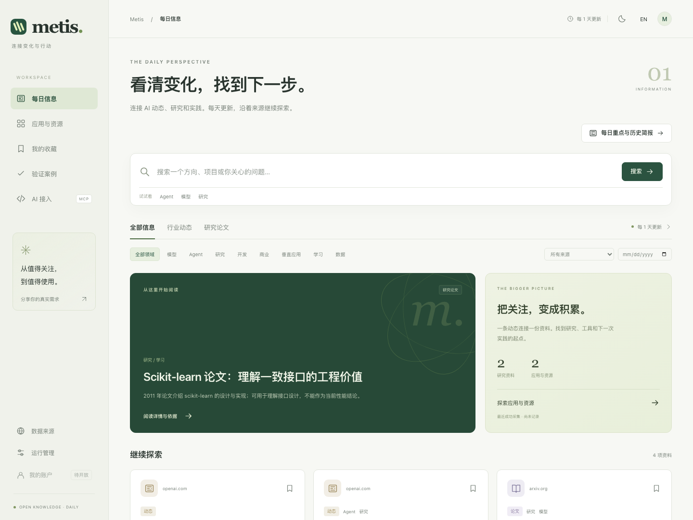
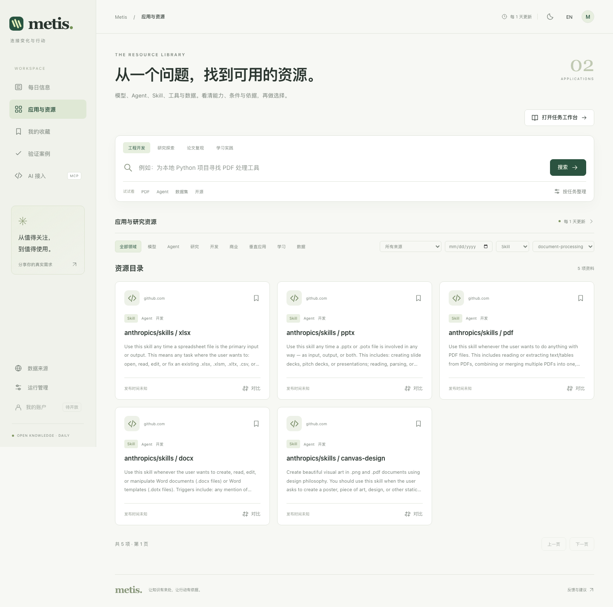
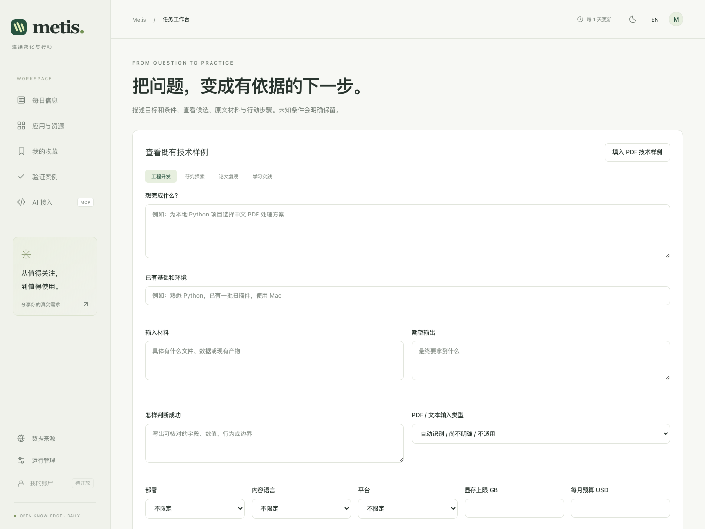

# Metis

**把 AI 动态、研究与开源资源，整理成有来源、可用于下一步工作的材料。**

[English](README.en.md) · [文档](docs/README.md) · [更新记录](CHANGELOG.md) · [路线图](ROADMAP.md)

[](https://github.com/Kevinxnova/metis/actions/workflows/ci.yml)
[](LICENSE)

Metis 面向研究者、工程师、研究生和学生：人可以浏览重点、比较资源、核对依据；AI 可以通过 API / MCP 查询事实、按需读取原文、获取任务资料。两种入口共用来源、版本与验证记录。



*当前开发界面，截图使用六条显式导入的本地样本；来源状态和内容数量不代表全网覆盖。*

## 当前状态

当前源码为 **v1.1.0-beta.2 开发候选版**，仍在开发分支，尚未作为正式版本发布。v1.0.0 是此前的开源基线。

- 信息、资源、任务工作台、管理页面和只读 MCP 已有可用基础，具体缺口见 [42 项 REQ](docs/product/requirements.md)。
- 自动检查与更新周期统一为 **1 天**；失败、积压、过期和未知条件分别保留。
- 公开账户、注册与同步暂不开放，页面标注“待开放”；本地收藏和关注可用。
- **产品主案例 pending**。已有技术样例用于回归检查，不作为已经解决真实需求的证明。

## 能做什么

| 入口 | 当前能力 |
| --- | --- |
| 信息 | 浏览事件和论文，按主题、来源、时间筛选，查看分层解读、简报及原始依据 |
| 应用与资源 | 查阅模型、Agent、Skill、工具、库、数据等档案，按能力筛选并比较采用条件与版本 |
| 任务工作台 | 输入目标、背景和条件，组织候选、版本材料、采用路径及待核实项，导出 Markdown |
| AI 接入 | 9 项只读 MCP 工具，支持 HTTP / stdio；与网页共用资料和证据 |
| 运行管理 | 维护来源、事实、分类、关系、处理队列和需求反馈 |

资料完整与实际运行通过分别标识。热度帮助发现内容，不能替代任务适配或研究质量判断。

<details>
<summary>查看资源与任务工作台</summary>



*资源截图来自 beta.2 的真实 Skill 收录与能力筛选；其他截图保留基础工作台展示。*



</details>

## 最近更新

| 版本 | 状态 / 日期 | 更新重点 |
| --- | --- | --- |
| [v1.1.0-beta.2](docs/releases/v1.1.0-beta.2.md) | 开发候选 · 2026-09-08 | Skill / Agent 版本材料、独立能力筛选、审核分页与重复候选、每日积压监控、事务回滚及完整研究导出 |
| [v1.1.0-beta.1](docs/releases/v1.1.0-beta.1.md) | 开发候选 · 2026-09-07 | 信息与资源工作台、事实和版本材料、只读 MCP；本次整理新旧代码、中文/英文文档、REQ 和版本导航 |
| v1.0.0 | 历史基线 · 2026-08-30 | 首个正式开源版本，工具发现、人工策展与 Newsletter 流程 |

完整变更见 [CHANGELOG](CHANGELOG.md)。每版说明保留升级影响、验证结果和未完成事项；尚未实施的重点放在 [ROADMAP](ROADMAP.md)。

## 快速开始

需要 Python 3.12/3.13 和 Node.js 20+。以下取得当前开发候选分支；使用 v1.0.0 标签会看到旧版工作流。

```bash
git clone --branch codex/metis-knowledge-workspace https://github.com/Kevinxnova/metis.git
cd metis
python3 -m venv .venv
source .venv/bin/activate
pip install -r requirements-dev.txt
cp .env.example .env
cd frontend
npm ci
cd ..
```

按需在 `.env` 设置管理员和定时任务凭证。已有 `.env` 请保留原文件。默认本地 SQLite；浏览与基础检索无需模型密钥。

分别在两个终端启动：

```bash
# 仓库根目录：后端
./scripts/start-backend.sh
```

```bash
# 仓库根目录：前端
cd frontend
npm run dev
```

打开 [http://localhost:5173](http://localhost:5173)。新数据库没有资料时，可在已激活环境的根目录显式导入六条短引用与整理样本：

```bash
python -m examples.editorial.load
```

首次浏览建议从“应用与资源”进入档案，核对来源、版本和未知项，再使用任务工作台。完整配置、隔离数据和检查办法见 [本地指南](docs/guides/local-development.md)。

## MCP 与 API

后端 MCP 地址：`http://127.0.0.1:8000/api/mcp`。网页“AI 接入”可检查连接。支持的工具包含检索、档案、原文分段、候选比较、任务资料、增量变化、来源、简报和研究材料。

stdio 桥接也可连接已运行的后端：

```bash
.venv/bin/python -m backend.mcp_stdio
```

客户端需把工作目录设为仓库根目录；可通过 `METIS_MCP_URL` 和 `METIS_READ_TOKEN` 配置服务地址与可选读取权限。HTTP API 位于 `/api/v1`。配置和参数示意见 [接入指南](docs/guides/ai-access.md)。

## 验证与下一步

后端、前端构建、协议调用和受控技术样例已有检查记录，见 [验证索引](docs/validation/README.md)。深度资料覆盖、研究比较、完整学习路径、部分运营功能、容器/生产数据库和真实用户收益仍需建设与验收。

当前更新重点：内容与来源运营、任务检索、研究材料、维护与部署。新主案例暂缓，恢复前会先重新对齐目标和验收标准。

## 文档与参与

[部署](DEPLOY.md) · [管理后台](docs/guides/management.md) · [架构](docs/architecture/README.md) · [贡献](CONTRIBUTING.md) · [安全报告](SECURITY.md)

旧策展与 Newsletter 仍通过 `/admin/curation` 保留，代码已独立归类。Metis 使用 [MIT License](LICENSE)。欢迎反馈实际任务、缺失资料和失败原因。
