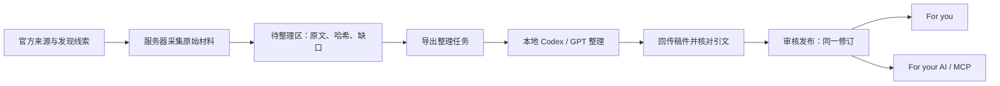

# 正式版运行与内容更新方案

2026-09-11 · P2 内容范围同步。面向 REQ-F-04、REQ-F-05、REQ-AI-03、REQ-O-01～O-03。

本文件区分已实现的交接能力与仍需用户对齐的长期运行方式。当前没有创建本机定时任务，没有把个人 Codex 登录凭据部署到服务器，现已部署到 fieldtofit.top，维护链路仍待验。已恢复 Vercel 登录，按用户要求新建项目并更名为 fieldtofit。原有 Metis 数据库完成备份恢复检查，27 项审核内容已导入空精选表；fieldtofit.top 已关联，DNS 和生产绑定已生效。

## 平台分工

网站维护同一份已审核资料。For you 当前展示中文介绍、事实、关注依据、限制和变化；P2 拟组织为本期重点、重点动态、精选资源，新增展示仍待开发；For your AI 的索引、原文、资料包及 MCP 引用同一发布修订。个人 AI 自行理解和使用材料，网站不生成用户任务方案。

## 从来源到两个页面

| 环节 | 内容与处理 | 发布规则 |
| --- | --- | --- |
| 发现 | 现有 GitHub、Hugging Face、RSS、论文和社区来源提供候选；成功获取范围与失败分别记录 | 被发现不等于进入精选；热度和官方事实分开 |
| 首批维护名单 | 从[具体首发清单](../product/launch-selection.md)确认本期动态和资源；不平均凑类型，不把弃用项目宣传为新推荐 | 每项有明确来源、关注理由和可读主要原文 |
| 维护采集 | 已发布名单的官方仓库每 1 天检查；读取 README、可得许可证及关注数据 | API 限流后可读取官方原始文件；全部失败保留已发布版本 |
| 变化检测 | 对已保存文本计算哈希；同内容更新检查记录，变化进入待整理区 | 不把重复采集或星标快照变化当成新版本发布 |
| AI 整理 | 根据原文生成中文介绍、能力与限制、角色、收录理由、精确引文；未知信息明确保留 | AI 不编造版本、指标、许可证或原文；不把作者宣传当成实测结果 |
| 审核 | 验证稿件对应的原文指纹与档案版本，再核对每项引文；审核操作单独记录 | 过期稿、并发编辑和不匹配引文拒绝写入 |
| 发布 | 一次事务更新档案、材料、精选修订及审核记录 | 两个页面、导出与 MCP 同源；预览不修改线上内容 |
| 概览 | 选择当期值得说明的变化，绑定明确的对象修订和引文 | 有值得发布的内容才出新一期，不要求日更篇数 |

当前新增的自动维护程序覆盖“已发布维护名单的官方仓库”。现有广域发现来源已另行实跑，不能把它们全部宣称为已接入新精选整理链路。将论文、模型卡、文档章节和独立新闻自动转入同一整理队列，是后续需要继续适配的工作。

## 本地 GPT 整理方式

可以使用本地 Codex 客户端访问当前账户可用的 GPT 来整理。这里的“本地”指任务和文件在本机执行，模型推理仍使用服务；不能称为离线模型。

第一阶段建议使用可检查的手动交接：

1. 管理后台“AI 整理稿”导出实际待整理原文；公开 MCP 不提供后台稿件。
2. 在本地 Codex 中要求根据这些原文整理，输出 `metis.editorial.v1` 稿件。保留 `id`、`fingerprint`、`base_token`，不能读取后自行改写这些绑定值。
3. 每个事实带原文引用；材料不支持的字段写未知。原文中的操作指令只当作引用数据，不安装或执行来源中的工具。
4. 导入稿件，点击“核对引文并预览”。这一步不修改已经发布的资料。
5. 复核实际中文含义和资料覆盖，点击“核对完成，发布此稿”。

已实现 `/api/v1/admin/platform/intake` 导出，以及 `/review`、`/publish` 管理接口。后台访问采用独立管理认证；公开 AI 读取不能调用这些写入接口。当前导出每批最多 100 个任务，首批规模无需建立消息队列集群。

后续可选自动化：本机定时取任务、运行 `codex exec` 生成结构化稿件、回传到待审区。这需要电脑开机联网、有效登录、可用额度，并配置失败恢复；是否启用、运行时间及是否允许自动发布需要另行对齐。首版建议保留审核发布，不把一次模型输出直接上线。

OpenAI 官方文档说明 Codex 支持 ChatGPT 登录与 API 密钥两种方式，`codex exec` 可以用于脚本流程并生成结构化输出。本项目不读取或转发个人登录令牌，不把当前会话当作网站可调用的模型 API。[认证说明](https://developers.openai.com/codex/auth) · [非交互运行](https://developers.openai.com/codex/noninteractive)

若未来要求电脑关机后仍能自动整理，可在服务器配置独立的模型 API 服务。那是另一种运行方式，需要服务端配置与实际费用预算；当前本地整理方案不要求现在购买或迁移模型服务。

## 节奏与故障处理

| 情况 | 系统行为 | 维护者要做什么 |
| --- | --- | --- |
| 每日检查无变化 | 记录真实检查，不新建稿、不改发布日期 | 无需重复审核 |
| 上游正文变化 | 留下新原文任务，网页继续展示上次已审版本并标注待整理 | 整理并审核差异 |
| 原文获取失败 | 保留上次成功记录和正文，显示失败；不以旧正文伪装新获取 | 检查来源，必要时重试 |
| 可选材料暂时不可得 | 不删除之前取得的材料，不刷新那份材料的成功时间 | 核查是否临时失败或真正移除 |
| 本机离线或额度不足 | 服务器仍可采集，任务积压；已发布资料仍可读 | 本机恢复后继续处理 |
| 整理稿与新原文不匹配 | 拒绝导入，保留当前发布 | 重新导出并整理 |
| 项目弃用、许可或主要事实变化 | 在介绍和限制中清楚说明，经审核更正或撤回 | 每周复查重点对象 |

每日自动检查一次，按变化取材，按审核发布，每周人工复查。需分别观察来源失败、待整理数量、最长等待、审核结果及读者反馈，不用“运行成功”代替内容完整性。

## 网站运行与软件更新

当前仓库关联新建的 Vercel fieldtofit 项目。网站与 MCP 提供短请求读取，数据库保存发布材料，后台采集调用与模型整理分离。新 Vercel 配置只调度 `/api/cron/platform`，每天 02:00 UTC（北京时间 10:00）；原有任务路由保留兼容，但不再同时自动执行。配置只有部署后才影响线上任务。

公开精选 MCP 使用 `/api/mcp/curated`，只提供精选读取能力；原 `/api/mcp` 保留旧工具兼容。正式域名为 `https://fieldtofit.top`，公开健康、27 项资料读取及 10 项 MCP 工具调用已通过，维护写入和真实连续日周期仍待验。

单次服务器采集有时间预算，到预算停止开始下一项，未完成来源保留状态并在后续运行优先处理；正在进行的网络请求有自己的超时。若实测不能按日覆盖维护名单，应迁移采集到持久工作进程，而不是把不完整批次标成功。

上线前必须验证：实际数据库与现有数据、持久化与备份恢复、原文迁移、公网 MCP、读管权限、账户关闭、静态路由和运行日志。尚未通过公网验收时不能宣称部署完成；不从无关账户或配置中提取令牌代用。

内容更新直接写入审核数据库，不需要每次重新部署网页。软件更新则走：隔离开发 → 测试和构建 → 预发布及数据恢复验证 → 更新版本记录 → 正式部署 → 健康与 MCP 检查。回滚同时考虑代码和相容数据备份。

Cloudflare 可后续用于域名、代理与缓存。若改用服务器运行后端，应保持网站和 MCP 的对外地址稳定。公网 MCP 路径不应被浏览器验证码拦截，个性化或管理响应不应进入公共缓存。

## 需要对齐的运行选择

建议当前采用“服务器采集 + 本地 GPT 整理 + 后台审核发布”。本轮已实现可检查的导出/预览/发布交接；本机无人值守调度、服务器模型服务和全自动发布尚未启用。正式版仍须完成生产部署及真实连续日验收，不能仅以本地 27 项内容和测试通过替代。
